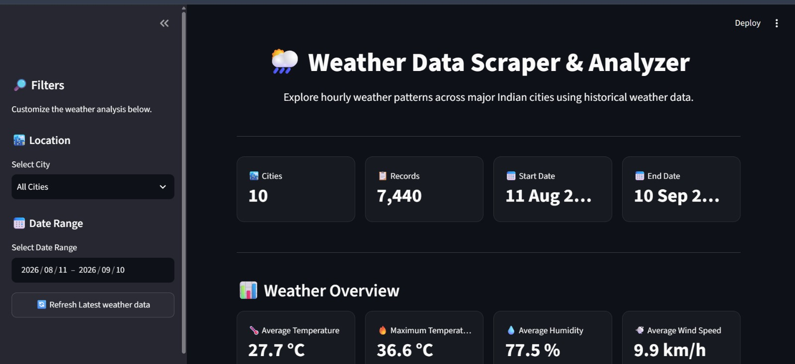

# 🌦️ Weather Data Scraper & Analyzer

An interactive weather analytics dashboard built with Python and Streamlit.

The project collects hourly weather data for 10 major Indian cities and provides interactive analysis of temperature, humidity, rainfall, wind speed, atmospheric pressure, cloud cover, and weather conditions.

## 📸 Dashboard Preview



## 🚀 Features

- Collects hourly weather data
- Covers 10 major Indian cities
- Approximately 30 days of weather data
- Interactive city and date filters
- Temperature analysis
- Humidity analysis
- Rainfall analysis
- Wind speed analysis
- Weather-condition distribution
- City comparison
- Automatic weather insights
- Filtered CSV download
- Refresh latest weather data

## 🛠️ Technologies Used

- Python
- Pandas
- NumPy
- Requests
- Plotly
- Streamlit

## 📂 Project Structure

```text
weather-data-scraper-analyzer/
│
├── app.py
├── weather_scraper.py
├── weather_data.csv
├── requirements.txt
├── dashboard.png
├── README.md
└── .gitignore


▶️ Run Locally

Install the required packages:
pip install -r requirements.txt

Run the weather scraper:

python weather_scraper.py

Run the Streamlit dashboard:
streamlit run app.py


📊 Data

The project collects hourly weather information including temperature, humidity, precipitation, rain, wind speed, wind direction, atmospheric pressure, cloud cover, and weather conditions.

👨‍💻 Author

Talha Ali 